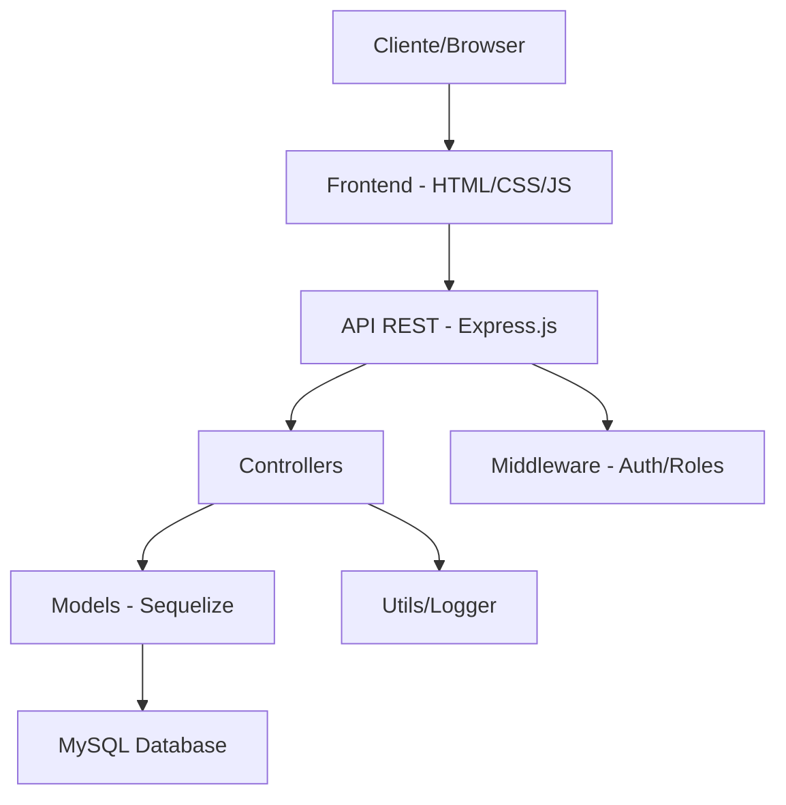

# 🔐 Portal de Gestão de Acessos - KNAPP SUDAMERICA

<div align="center">


**Sistema completo de gestão de usuários, empresas e controle de acessos**

*Desenvolvido para KNAPP SUDAMERICA & MAIS INTELIGÊNCIA*

</div>

---

## 📋 Índice

- [🚀 Sobre o Projeto](#-sobre-o-projeto)
- [⚡ Tecnologias](#-tecnologias)
- [🏗️ Arquitetura](#️-arquitetura)
- [📦 Pré-requisitos](#-pré-requisitos)
- [🔧 Instalação](#-instalação)
- [⚙️ Configuração](#️-configuração)
- [🎯 Como Executar](#-como-executar)
- [✨ Funcionalidades](#-funcionalidades)
- [👥 Roles e Permissões](#-roles-e-permissões)
- [🗂️ Estrutura do Projeto](#️-estrutura-do-projeto)
- [🌐 API Endpoints](#-api-endpoints)
- [🎨 Design System](#-design-system)
- [📱 Responsividade](#-responsividade)
- [🔒 Segurança](#-segurança)
- [🐛 Troubleshooting](#-troubleshooting)
- [🤝 Contribuição](#-contribuição)
- [📄 Licença](#-licença)

---

## 🚀 Sobre o Projeto

O **Portal de Gestão de Acessos** é uma aplicação web completa desenvolvida para gerenciar usuários, empresas e controle de acessos de forma segura e eficiente. O sistema foi projetado seguindo as melhores práticas de segurança e usabilidade.

### 🎯 **Principais Objetivos:**
- Gerenciamento centralizado de usuários e empresas
- Sistema de aprovação para novos cadastros
- Controle de acesso baseado em roles (RBAC)
- Auditoria completa através de logs
- Interface moderna e responsiva
- Integração preparada para Oracle Cloud Infrastructure (OCI)

### 🏆 **Diferenciais:**
- ✅ **100% Funcional** - Sistema completo pronto para produção
- ✅ **Seguro** - JWT + bcrypt + validações completas
- ✅ **Responsivo** - Funciona em desktop, tablet e mobile
- ✅ **Auditável** - Logs detalhados de todas as ações
- ✅ **Escalável** - Arquitetura modular e organizadas
- ✅ **Profissional** - Identidade visual da KNAPP

---

## ⚡ Tecnologias

### **Backend:**


### **Frontend:**


### **Segurança:**


### **Utilitários:**


---

## 🏗️ Arquitetura

O projeto segue a arquitetura **MVC (Model-View-Controller)** com separação clara de responsabilidades:



### **Camadas da Aplicação:**

1. **Frontend (Client-side):**
   - Interface em HTML/CSS/JS puro
   - SPA (Single Page Application)
   - Gerenciamento de estado local
   - Comunicação via API REST

2. **Backend (Server-side):**
   - API REST com Express.js
   - Autenticação JWT
   - Middleware de segurança e validação
   - Logging de ações

3. **Banco de Dados:**
   - MySQL com Sequelize ORM
   - Relacionamentos bem definidos
   - Migrações automáticas

---

## 📦 Pré-requisitos

Antes de começar, certifique-se de ter instalado:

- **Node.js** >= 16.0.0 ([Download](https://nodejs.org/))
- **npm** >= 8.0.0 (vem com Node.js)
- **MySQL** >= 8.0 ([Download](https://dev.mysql.com/downloads/))
- **Git** ([Download](https://git-scm.com/))

### **Verificar instalações:**
```bash
node --version    # v18.x.x ou superior
npm --version     # 8.x.x ou superior
mysql --version   # mysql Ver 8.0.x ou superior
```

---

## 🔧 Instalação

### **1. Clone o repositório:**
```bash
git clone https://github.com/seu-usuario/portal-gestao-acessos.git
cd portal-gestao-acessos
```

### **2. Instale as dependências:**
```bash
npm install
```

### **3. Configure o banco de dados MySQL:**
```sql
-- Conectar ao MySQL como root
mysql -u root -p

-- Criar banco de dados
CREATE DATABASE portal_gestao_acessos;

-- Criar usuário específico (opcional, mas recomendado)
CREATE USER 'portal_user'@'localhost' IDENTIFIED BY 'portal_password';
GRANT ALL PRIVILEGES ON portal_gestao_acessos.* TO 'portal_user'@'localhost';
FLUSH PRIVILEGES;
```

---

## ⚙️ Configuração

### **1. Criar arquivo `.env`:**
```bash
cp .env.example .env
```

### **2. Configurar variáveis de ambiente:**
```env
# Servidor
NODE_ENV=development
PORT=3000

# Banco de Dados
DB_HOST=localhost
DB_PORT=3306
DB_NAME=portal_gestao_acessos
DB_USER=portal_user
DB_PASS=portal_password

# JWT
JWT_SECRET=seu_jwt_secret_super_seguro_aqui_123
JWT_EXPIRES_IN=24h

# Outros
LOG_LEVEL=info
```

### **3. Inicializar banco de dados:**
```bash
npm run db-setup
```

Este comando irá:
- Criar todas as tabelas necessárias
- Inserir dados iniciais
- Criar usuário administrador padrão:
  - **Email:** `admin@example.com`
  - **Senha:** `batata123`
  - **Role:** `admin`

---

## 🎯 Como Executar

### **💻 Ambiente de Desenvolvimento:**
```bash
# Executar apenas o servidor backend
npm run server

# O frontend será servido pelo Express na porta 3000
# Acesse: http://localhost:3000
```

### **🚀 Ambiente de Produção:**
```bash
# Executar em produção
npm start
```

### **🔄 Scripts Disponíveis:**
```bash
npm run server    # Executa com nodemon (desenvolvimento)
npm start         # Executa em produção
npm run db-setup  # Inicializa o banco de dados
```

---

## ✨ Funcionalidades

### 🔐 **Autenticação e Autorização**
- [x] Login/logout seguro com JWT
- [x] Registro de usuários com aprovação
- [x] Sistema de roles (Admin, Gerente, Operador)
- [x] Proteção de rotas por permissão
- [x] Sessão automática e renovação de token

### 👥 **Gerenciamento de Usuários**
- [x] Listagem de usuários com filtros
- [x] Aprovação/rejeição de cadastros
- [x] Associação de usuários a empresas
- [x] Visualização de perfis detalhados
- [x] Controle de status (Pendente/Aprovado/Rejeitado)

### 🏢 **Gerenciamento de Empresas**
- [x] CRUD completo de empresas
- [x] Associação com usuários
- [x] Controle de localização
- [x] Validação de exclusão (empresas com usuários)

### 📊 **Dashboard e Relatórios**
- [x] Estatísticas em tempo real
- [x] Contadores animados
- [x] Gráficos de status de usuários
- [x] Métricas de empresas

### 📋 **Sistema de Logs**
- [x] Auditoria completa de ações
- [x] Filtros por data e usuário
- [x] Visualização hierárquica por role
- [x] Exportação de logs

### 🌐 **Requisições JSON (OCI)**
- [x] Simulação de JSONs para usuários
- [x] Simulação de JSONs para grupos
- [x] Interface com abas
- [x] Formatação e validação

### 📱 **Interface e UX**
- [x] Design responsivo (Mobile-first)
- [x] Identidade visual KNAPP
- [x] Animações suaves
- [x] Feedback visual completo
- [x] Modais e notificações
- [x] Loading states

---

## 👥 Roles e Permissões

### **🔴 Administrador (`admin`)**
```
✅ Acesso total ao sistema
✅ Gerenciar usuários (aprovar/rejeitar/associar)
✅ CRUD completo de empresas
✅ Visualizar todos os logs
✅ Acessar requisições JSON
✅ Gerenciar configurações do sistema
```

### **🟡 Gerente (`gerente`)**
```
✅ Gerenciar usuários da sua empresa
✅ Aprovar/rejeitar usuários da empresa
✅ Visualizar empresas (somente leitura)
✅ Visualizar logs da sua empresa
✅ Acessar requisições JSON
❌ Criar/editar/excluir empresas
❌ Gerenciar usuários de outras empresas
```

### **🟢 Operador (`operador`)**
```
✅ Visualizar próprio perfil
✅ Editar dados pessoais
✅ Visualizar próprios logs
✅ Acessar requisições JSON
❌ Gerenciar outros usuários
❌ Acessar dados de empresas
❌ Funções administrativas
```

---

## 🗂️ Estrutura do Projeto

```
PORTAL-GESTAO-ACESSOS/
│
├── 📄 README.md                    # Documentação do projeto
├── 📄 package.json                 # Dependências e scripts
├── 📄 server.js                    # Servidor principal
├── 📄 app.js                       # Configuração Express
├── 📄 .env                         # Variáveis de ambiente
├── 📄 .gitignore                   # Arquivos ignorados pelo Git
│
├── 📁 config/                      # Configurações
│   └── database.js                 # Configuração do banco
│
├── 📁 controllers/                 # Controladores da API
│   ├── authController.js           # Autenticação
│   ├── usuarioController.js        # Usuários
│   ├── empresaController.js        # Empresas
│   ├── logController.js            # Logs
│   └── jsonController.js           # Simulação JSON
│
├── 📁 middleware/                  # Middlewares
│   ├── auth.js                     # Autenticação JWT
│   ├── roles.js                    # Controle de permissões
│   └── validation.js               # Validação de dados
│
├── 📁 models/                      # Modelos do banco
│   ├── index.js                    # Relacionamentos
│   ├── Usuario.js                  # Modelo de usuário
│   ├── Empresa.js                  # Modelo de empresa
│   └── Log.js                      # Modelo de log
│
├── 📁 routes/                      # Rotas da API
│   ├── authRoutes.js               # Rotas de autenticação
│   ├── usuarioRoutes.js            # Rotas de usuários
│   ├── empresaRoutes.js            # Rotas de empresas
│   ├── logRoutes.js                # Rotas de logs
│   └── jsonRoutes.js               # Rotas de simulação
│
├── 📁 utils/                       # Utilitários
│   └── logger.js                   # Sistema de logs
│
├── 📁 init/                        # Scripts de inicialização
│   └── setupDB.js                  # Setup inicial do banco
│
├── 📁 public/                      # Frontend - Arquivos públicos
│   ├── index.html                  # Página principal
│   └── assets/                     # Assets estáticos
│       └── images/                 # Imagens (logos, etc)
│
└── 📁 src/                         # Frontend - Código fonte
    ├── 📁 css/                     # Estilos
    │   ├── styles.css              # Estilos principais
    │   └── components.css          # Estilos de componentes
    │
    ├── 📁 js/                      # JavaScript
    │   ├── app.js                  # Controlador principal
    │   ├── api.js                  # Gerenciador de API
    │   ├── auth.js                 # Autenticação
    │   ├── dashboard.js            # Dashboard
    │   ├── users.js                # Gerenciamento de usuários
    │   ├── companies.js            # Gerenciamento de empresas
    │   └── utils.js                # Utilitários
    │
    └── 📁 components/              # Componentes reutilizáveis
        └── modal.js                # Sistema de modais
```

---

## 🌐 API Endpoints

### **🔐 Autenticação**
```http
POST   /api/auth/register      # Registrar usuário
POST   /api/auth/login         # Fazer login
GET    /api/auth/debug         # Debug (desenvolvimento)
```

### **👥 Usuários**
```http
GET    /api/usuarios/me              # Perfil do usuário logado
GET    /api/usuarios                 # Listar usuários
GET    /api/usuarios/:id             # Obter usuário específico
PATCH  /api/usuarios/:id/aprovar     # Aprovar/rejeitar usuário
PATCH  /api/usuarios/:id/empresa     # Associar usuário à empresa
```

### **🏢 Empresas**
```http
GET    /api/empresas           # Listar empresas
GET    /api/empresas/:id       # Obter empresa específica
POST   /api/empresas           # Criar empresa [ADMIN]
PUT    /api/empresas/:id       # Atualizar empresa [ADMIN]
DELETE /api/empresas/:id       # Excluir empresa [ADMIN]
```

### **📝 Logs**
```http
GET    /api/logs?usuario_id=X&data_inicio=Y&data_fim=Z    # Listar logs com filtros
```

### **📋 Simulação JSON**
```http
GET    /api/simulacao-json/usuario    # JSON exemplo para usuário OCI
GET    /api/simulacao-json/grupo      # JSON exemplo para grupo OCI
```

---

## 🎨 Design System

### **🎨 Paleta de Cores (Especificação KNAPP):**
```css
/* Cores Principais */
--cl-primary: #AEC455;           /* Verde KNAPP */
--cl-secondary: #416d9c;         /* Azul Corporativo */
--cl-secondary-dark: #345a82;    /* Azul Escuro */

/* Backgrounds */
--bg-color: #fefefe;             /* Fundo principal */
--bg-color-nav: #d2d3d5;         /* Fundo navegação */
--primary-color: rgb(238, 238, 238);  /* Cinza claro */
--secondary-color: #fcfcfc;      /* Branco secundário */

/* Textos */
--text-color: black;             /* Texto principal */
--text-color-nav: #49494B;       /* Texto navegação */

/* Bordas e Sombras */
--border-color: rgb(191, 191, 191);     /* Bordas */
--shadow-primary: rgba(0, 0, 0, 0.2);   /* Sombra principal */
```

### **📱 Breakpoints Responsivos:**
- **Mobile:** ≤ 768px
- **Tablet:** 769px - 1024px
- **Desktop:** ≥ 1025px

### **🎯 Componentes Principais:**
- **Botões:** Primary, Secondary, Outline, Danger
- **Cards:** Stat cards, Profile cards, Company cards
- **Modais:** Confirmation, Alert, Form modals
- **Tabelas:** Data tables com paginação
- **Formulários:** Validação em tempo real

---

## 📱 Responsividade

O sistema é **Mobile-First** e adapta-se perfeitamente a diferentes dispositivos:

### **📱 Mobile (≤ 768px):**
- Menu lateral colapsível
- Cards empilhados verticalmente
- Tabelas com scroll horizontal
- Botões full-width
- Modal otimizado para touch

### **💻 Tablet (769px - 1024px):**
- Layout híbrido
- Sidebar compacta
- Grid responsivo 2-3 colunas

### **🖥️ Desktop (≥ 1025px):**
- Layout completo
- Sidebar fixa
- Grid 4 colunas
- Hover effects completos

---

## 🔒 Segurança

### **🛡️ Medidas Implementadas:**

1. **Autenticação:**
   - JWT com expiração configurável
   - Hash bcrypt (strength 12)
   - Verificação automática de sessão

2. **Autorização:**
   - Middleware de roles
   - Proteção de rotas por permissão
   - Validação server-side

3. **Validação:**
   - Express-validator
   - Sanitização de inputs
   - Validação de tipos de dados

4. **Prevenção:**
   - CORS configurado
   - Headers de segurança
   - Rate limiting (recomendado para produção)

5. **Auditoria:**
   - Logs de todas as ações
   - Rastreamento de usuários
   - Timestamps precisos

### **🔐 Boas Práticas:**
- Senhas nunca armazenadas em texto plano
- Tokens JWT com tempo de vida limitado
- Validação dupla (frontend + backend)
- Logs detalhados para auditoria
- Sanitização de dados de entrada

---

## 🐛 Troubleshooting

### **❌ Problemas Comuns:**

#### **Erro de Conexão com Banco:**
```
Unable to connect to the database
```
**Solução:**
1. Verificar se MySQL está rodando
2. Conferir credenciais no `.env`
3. Testar conexão manual: `mysql -u usuario -p`

#### **Erro de Token Inválido:**
```
Token inválido ou expirado
```
**Solução:**
1. Fazer logout e login novamente
2. Verificar `JWT_SECRET` no `.env`
3. Limpar localStorage do navegador

#### **Erro de Permissão:**
```
Acesso negado. Você não tem permissão
```
**Solução:**
1. Verificar role do usuário no banco
2. Conferir se usuário está aprovado
3. Verificar middleware de roles

#### **Porta já em uso:**
```
Error: listen EADDRINUSE :::3000
```
**Solução:**
```bash
# Encontrar processo usando a porta
lsof -i :3000

# Matar processo
kill -9 <PID>

# Ou usar porta diferente
PORT=3001 npm run server
```

### **🔧 Comandos de Debug:**
```bash
# Logs detalhados
DEBUG=* npm run server

# Verificar banco de dados
npm run db-setup

# Testar APIs
curl -X GET http://localhost:3000/api/auth/debug
```

---

## 🤝 Contribuição

Contribuições são sempre bem-vindas! Para contribuir:

### **📋 Como Contribuir:**

1. **Fork** o repositório
2. **Clone** seu fork: `git clone https://github.com/seu-usuario/portal-gestao-acessos.git`
3. **Crie** uma branch: `git checkout -b feature/nova-funcionalidade`
4. **Faça** suas alterações
5. **Commit**: `git commit -m 'feat: adiciona nova funcionalidade'`
6. **Push**: `git push origin feature/nova-funcionalidade`
7. **Abra** um Pull Request

### **📝 Padrões de Commit:**
```
feat: nova funcionalidade
fix: correção de bug
docs: atualização de documentação
style: mudanças de estilo (não afeta lógica)
refactor: refatoração de código
test: adição de testes
chore: mudanças em arquivos de configuração
```

### **🧪 Antes de Contribuir:**
- Teste todas as funcionalidades
- Mantenha a documentação atualizada
- Siga os padrões de código existentes
- Adicione testes se necessário

---

## 📄 Licença

Este projeto é propriedade da **KNAPP SUDAMERICA** e **MAIS INTELIGÊNCIA**.

Desenvolvido como parte da **Jornada de Aprendizagem - Gerência da Qualidade** do **Sistema FIEP**.

**Turma:** 6º/7º Período / 2025  
**Professora:** Ana Christina Vanali

---

## 👏 Créditos e Agradecimentos

### **🏢 Organizações:**
- **KNAPP SUDAMERICA** - Parceiro e especificações do projeto
- **MAIS INTELIGÊNCIA** - Parceiro técnico
- **Sistema FIEP** - Instituição de ensino

### **👨‍🏫 Orientação:**
- **Profª Ana Christina Vanali** - Orientação e supervisão

### **🛠️ Tecnologias Utilizadas:**
- **Node.js** & **Express.js** - Backend framework
- **MySQL** & **Sequelize** - Banco de dados
- **HTML5/CSS3/ES6+** - Frontend moderno
- **JWT** & **bcrypt** - Segurança

---

## 📞 Suporte e Contato

### **🔗 Links Importantes:**
- **Website KNAPP:** [https://www.knapp.com/](https://www.knapp.com/)
- **LinkedIn KNAPP:** [https://www.linkedin.com/company/knapp-sudamerica/](https://www.linkedin.com/company/knapp-sudamerica/)
- **Sistema FIEP:** [https://www.sistemafiep.org.br/](https://www.sistemafiep.org.br/)

### **📧 Para Suporte:**
1. Verifique a seção [Troubleshooting](#-troubleshooting)
2. Consulte os logs do sistema
3. Verifique a documentação da API
4. Abra uma issue no repositório

---

<div align="center">

**Desenvolvido com ❤️ para KNAPP SUDAMERICA**


*Portal de Gestão de Acessos - Versão 1.0*

</div>